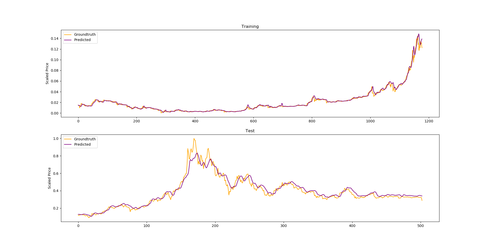

# Bitcoin-Prediction 

This project is an attempt to build strong indicators to use in criptocurrency trading. The main strategy is concerned in combining Sentiment and Price Analysis by using recent techniques in Artificial Intelligence (AI).

# Price-Polarity-LSTM (pp-lstm)

Price-Polarity-LSTM (pp-lstm) uses sentiment data (polarity) from social media (twitter and reddit), as well as price features (open, close, low, high, volume and market capitalization) and a special kind of Recurrent Neural Network (RNN) known as Long Short Term Memory network (LSTM) to predict bitcoin future price.

# Usage
### Training/Testing Phase

* Generates bitcoin sentiment dataset from reddit: 
    ```
        python reddit_archived_bitcoin_sentiment.py --o reddit_bitcoin_sentiment.csv --d 2018/12/01 --n 2000 --v --k your_havenondemand_api_key
    ```
* Generates bitcoin price dataset from alphavantage: 
    ```
        python alphavantage.py --o alphavantage_bitcoin_price.csv --s BTC --m USD --k your_alphavantage_api_key
    ```
* Merge both sentiment and price datasets: 
    ```
        python merge_data.py --s reddit_bitcoin_sentiment.csv --p alphavantage_bitcoin_price.csv --o merged_data.csv
    ```
* Build the model (train and test):
    ```
        python build_model.py --lookback 2 --sent --s --d merged_data.csv
    ```

# Results



### Live Phase (in development...)
* Continously collects twitter sentiment data till user press ctrl+c - 
    ```
        live_twitter_sentiment.py 
    ``` 
    Output: bitcoin_tweets.json 

# Requirements
Python 3.6

```bash
pip install -r requirements.txt
```

# Future work

* Reinforcement Learning
* Live Phase 